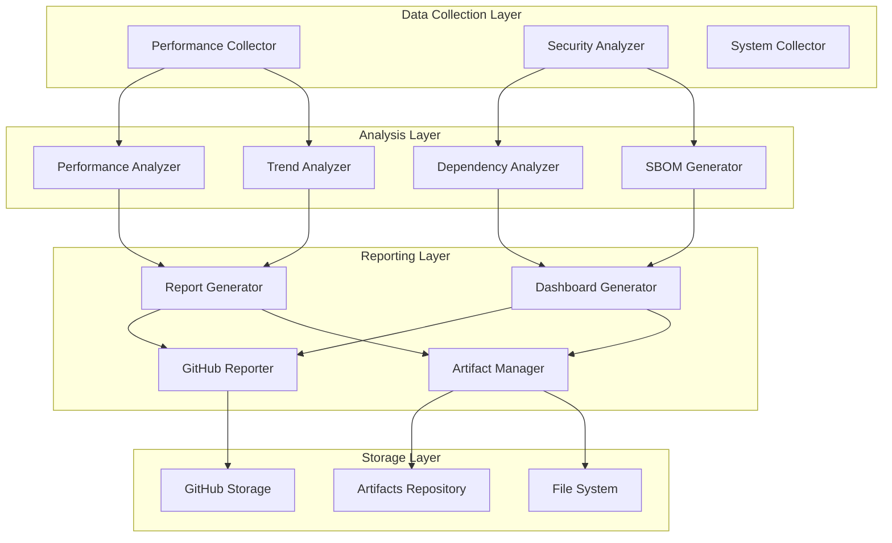

# CI Pipeline Architecture

This document provides a comprehensive overview of the HB Strategy Sandbox CI pipeline architecture, including component relationships, data flows, and extension points.

## System Overview

The CI pipeline is built with a modular, extensible architecture that separates concerns into distinct components while maintaining clean interfaces and data flows.



## Core Components

### Performance Module

The performance module handles all aspects of performance monitoring and analysis.

#### Performance Collector (`strategy_sandbox.performance.collector`)

**Purpose**: Collects performance metrics from various sources
**Interfaces**:
- `collect_system_info()` - System and environment data
- `process_benchmark_results()` - Pytest-benchmark data processing
- `store_baseline()` - Baseline management
- `load_history()` - Historical data retrieval

**Key Classes**:
```python
class PerformanceCollector:
    """Main collector for performance metrics."""

    def __init__(self, config_path: Optional[Path] = None):
        self.config = self._load_config(config_path)
        self.metrics = PerformanceMetrics()

    def collect_system_info(self) -> Dict[str, Any]:
        """Collect system and environment information."""

    def process_benchmark_results(self, benchmark_file: Path) -> BenchmarkData:
        """Process pytest-benchmark JSON output."""

    def store_baseline(self, metrics: PerformanceMetrics, tag: str):
        """Store performance baseline."""

    def compare_with_baseline(self, current: PerformanceMetrics) -> ComparisonResult:
        """Compare current metrics with baseline."""
```

**Data Models**:
```python
@dataclass
class PerformanceMetrics:
    """Container for performance metrics."""
    timestamp: datetime
    environment: SystemInfo
    benchmarks: List[BenchmarkResult]
    system_metrics: SystemMetrics

@dataclass
class BenchmarkResult:
    """Individual benchmark result."""
    name: str
    mean: float
    std: float
    min: float
    max: float
    unit: str
    ops: Optional[float] = None
```

#### Performance Comparator (`strategy_sandbox.performance.comparator`)

**Purpose**: Analyzes performance changes and detects regressions
**Key Features**:
- Statistical comparison against baselines
- Regression detection with configurable thresholds
- Multi-dimensional analysis (time, memory, throughput)
- Significance testing

```python
class PerformanceComparator:
    """Compares performance metrics and detects regressions."""

    def __init__(self, config: ThresholdConfig):
        self.config = config
        self.statistical_engine = StatisticalAnalyzer()

    def compare_benchmarks(
        self,
        current: PerformanceMetrics,
        baseline: PerformanceMetrics
    ) -> ComparisonReport:
        """Compare current metrics against baseline."""

    def detect_regressions(
        self,
        comparison: ComparisonReport
    ) -> List[PerformanceAlert]:
        """Detect performance regressions."""

    def calculate_statistical_significance(
        self,
        current: BenchmarkResult,
        baseline: BenchmarkResult
    ) -> StatisticalResult:
        """Calculate statistical significance of changes."""
```

#### Trend Analyzer (`strategy_sandbox.performance.trend_analyzer`)

**Purpose**: Provides time-series analysis and trend detection
**Capabilities**:
- Moving average calculations
- Anomaly detection using statistical methods
- Correlation analysis between metrics
- Predictive trend analysis

```python
class TrendAnalyzer:
    """Analyzes performance trends over time."""

    def __init__(self, config: TrendConfig):
        self.config = config
        self.window_size = config.window_size
        self.anomaly_threshold = config.anomaly_threshold

    def analyze_trends(
        self,
        historical_data: List[PerformanceMetrics]
    ) -> TrendAnalysis:
        """Analyze performance trends in historical data."""

    def detect_anomalies(
        self,
        metrics: List[float],
        window_size: int = None
    ) -> List[AnomalyPoint]:
        """Detect anomalies in metric values."""

    def calculate_correlation(
        self,
        metric1: List[float],
        metric2: List[float]
    ) -> CorrelationResult:
        """Calculate correlation between two metrics."""
```

### Security Module

The security module handles vulnerability scanning, SBOM generation, and security reporting.

#### Security Analyzer (`strategy_sandbox.security.analyzer`)

**Purpose**: Scans dependencies for vulnerabilities
**Features**:
- Multi-source vulnerability scanning
- Package manager detection and analysis
- Dependency tree generation
- Risk assessment and scoring

```python
class DependencyAnalyzer:
    """Analyzes project dependencies for security vulnerabilities."""

    def __init__(self, project_path: Path):
        self.project_path = project_path
        self.vulnerability_sources = self._initialize_sources()

    def scan_dependencies(self) -> SecurityScanResult:
        """Scan all project dependencies for vulnerabilities."""

    def detect_package_managers(self) -> List[PackageManager]:
        """Detect active package managers in project."""

    def generate_dependency_tree(self) -> DependencyTree:
        """Generate complete dependency tree."""

    def assess_risk_score(self, vulnerabilities: List[Vulnerability]) -> RiskScore:
        """Calculate overall security risk score."""
```

#### SBOM Generator (`strategy_sandbox.security.sbom_generator`)

**Purpose**: Generates Software Bill of Materials
**Formats Supported**:
- CycloneDX (JSON/XML)
- SPDX (JSON/YAML)
- Custom enhanced format

```python
class SBOMGenerator:
    """Generates Software Bill of Materials in various formats."""

    def __init__(self, analyzer: DependencyAnalyzer):
        self.analyzer = analyzer
        self.format_generators = {
            'cyclonedx': self._generate_cyclonedx,
            'spdx': self._generate_spdx,
            'custom': self._generate_custom
        }

    def generate_sbom(
        self,
        format_type: str,
        include_vulnerabilities: bool = True
    ) -> SBOMDocument:
        """Generate SBOM in specified format."""

    def generate_vulnerability_report(self) -> VulnerabilityReport:
        """Generate detailed vulnerability report."""

    def generate_compliance_report(
        self,
        frameworks: List[str]
    ) -> ComplianceReport:
        """Generate compliance report for specified frameworks."""
```

#### Security Dashboard Generator (`strategy_sandbox.security.dashboard_generator`)

**Purpose**: Creates comprehensive security dashboards
**Features**:
- Risk scoring and health assessment
- Vulnerability trend analysis
- Compliance status tracking
- Actionable recommendations

```python
class SecurityDashboardGenerator:
    """Generates comprehensive security dashboards."""

    def __init__(self, scan_results: SecurityScanResult):
        self.scan_results = scan_results
        self.scoring_engine = SecurityScoringEngine()

    def generate_security_dashboard(self) -> SecurityDashboard:
        """Generate complete security dashboard."""

    def calculate_security_score(self) -> SecurityScore:
        """Calculate overall security score."""

    def analyze_dependency_health(self) -> DependencyHealth:
        """Analyze health of project dependencies."""

    def generate_recommendations(self) -> List[SecurityRecommendation]:
        """Generate actionable security recommendations."""
```

### Reporting Module

The reporting module handles all aspects of report generation and distribution.

#### GitHub Reporter (`strategy_sandbox.reporting.github_reporter`)

**Purpose**: Integrates with GitHub Actions for rich reporting
**Features**:
- GitHub Step Summary generation
- Artifact creation and management
- Environment variable integration
- Workflow context awareness

```python
class GitHubReporter:
    """Handles GitHub Actions integration and reporting."""

    def __init__(self):
        self.github_env = self._collect_github_environment()
        self.step_summary_path = os.getenv('GITHUB_STEP_SUMMARY')

    def add_to_summary(self, content: str, title: str = None):
        """Add content to GitHub step summary."""

    def create_artifact(self, name: str, content: Union[str, dict]):
        """Create GitHub Actions artifact."""

    def generate_performance_report(
        self,
        metrics: PerformanceMetrics,
        comparison: ComparisonReport
    ) -> str:
        """Generate performance report for GitHub."""

    def generate_security_report(
        self,
        dashboard: SecurityDashboard
    ) -> str:
        """Generate security report for GitHub."""
```

#### Report Generator (`strategy_sandbox.reporting.report_generator`)

**Purpose**: Creates comprehensive reports and dashboards
**Capabilities**:
- Multi-format report generation
- Template-based rendering
- Data aggregation and summarization
- Cross-component integration

```python
class ReportGenerator:
    """Generates comprehensive reports from multiple data sources."""

    def __init__(self, github_reporter: Optional[GitHubReporter] = None):
        self.github_reporter = github_reporter or GitHubReporter()
        self.template_engine = TemplateEngine()
        self.artifact_manager = ArtifactManager()

    def generate_comprehensive_report(
        self,
        performance_data: PerformanceMetrics,
        security_data: SecurityDashboard,
        coverage_data: CoverageData = None
    ) -> ComprehensiveReport:
        """Generate complete project health report."""

    def generate_performance_dashboard(
        self,
        performance_data: PerformanceMetrics
    ) -> PerformanceDashboard:
        """Generate performance-specific dashboard."""

    def generate_build_dashboard(
        self,
        build_context: BuildContext
    ) -> BuildDashboard:
        """Generate build status dashboard."""
```

#### Artifact Manager (`strategy_sandbox.reporting.artifact_manager`)

**Purpose**: Manages report artifacts and storage
**Features**:
- File-based artifact storage
- Metadata management
- Artifact indexing and retrieval
- Cleanup and retention policies

```python
class ArtifactManager:
    """Manages report artifacts and storage."""

    def __init__(self, artifacts_dir: Path = None):
        self.artifacts_dir = artifacts_dir or Path("artifacts")
        self.metadata_store = ArtifactMetadataStore()

    def create_artifact(
        self,
        name: str,
        content: Union[str, dict, bytes],
        metadata: ArtifactMetadata = None
    ) -> ArtifactInfo:
        """Create and store artifact."""

    def list_artifacts(self, pattern: str = None) -> List[ArtifactInfo]:
        """List available artifacts."""

    def get_artifact_summary(self) -> ArtifactSummary:
        """Get summary of all artifacts."""

    def cleanup_old_artifacts(self, retention_days: int = 30):
        """Clean up old artifacts based on retention policy."""
```

## Data Flow Architecture

### Performance Data Flow

1. **Collection Phase**
   ```
   Benchmark Execution → JSON Output → Performance Collector → Structured Metrics
   ```

2. **Analysis Phase**
   ```
   Current Metrics + Historical Data → Comparator/Trend Analyzer → Analysis Results
   ```

3. **Reporting Phase**
   ```
   Analysis Results → Report Generator → GitHub Reporter → Step Summary/Artifacts
   ```

### Security Data Flow

1. **Scanning Phase**
   ```
   Project Dependencies → Security Analyzer → Vulnerability Data
   ```

2. **SBOM Generation**
   ```
   Dependency Tree + Vulnerability Data → SBOM Generator → SBOM Documents
   ```

3. **Dashboard Creation**
   ```
   Security Data → Dashboard Generator → Security Dashboard
   ```

4. **Integration**
   ```
   Security Dashboard → Report Generator → GitHub Integration
   ```

## Configuration Architecture

### Hierarchical Configuration

The system uses a hierarchical configuration approach:

1. **Default Configuration** - Built-in defaults
2. **Project Configuration** - Project-specific settings
3. **Environment Configuration** - Environment-specific overrides
4. **Runtime Configuration** - Command-line and environment variable overrides

### Configuration Schema

```python
@dataclass
class PipelineConfig:
    """Main pipeline configuration."""
    performance: PerformanceConfig
    security: SecurityConfig
    reporting: ReportingConfig
    storage: StorageConfig

@dataclass
class PerformanceConfig:
    """Performance monitoring configuration."""
    baseline_path: Path
    thresholds: ThresholdConfig
    trend_analysis: TrendConfig

@dataclass
class SecurityConfig:
    """Security scanning configuration."""
    vulnerability_sources: List[str]
    sbom_formats: List[str]
    policy: SecurityPolicy

@dataclass
class ReportingConfig:
    """Reporting configuration."""
    github_integration: bool
    artifact_retention: int
    templates: TemplateConfig
```

## Extension Points

### Custom Collectors

Implement custom data collectors:

```python
from strategy_sandbox.performance.collector import BaseCollector

class CustomMetricsCollector(BaseCollector):
    """Custom metrics collector implementation."""

    def collect(self) -> Dict[str, Any]:
        """Collect custom metrics."""
        return {
            "custom_metric_1": self._collect_metric_1(),
            "custom_metric_2": self._collect_metric_2()
        }

    def _collect_metric_1(self) -> float:
        """Implement custom metric collection."""
        pass
```

### Custom Analyzers

Add custom analysis capabilities:

```python
from strategy_sandbox.performance.comparator import BaseAnalyzer

class CustomPerformanceAnalyzer(BaseAnalyzer):
    """Custom performance analysis."""

    def analyze(self, data: PerformanceMetrics) -> AnalysisResult:
        """Implement custom analysis logic."""
        pass
```

### Custom Report Formats

Implement custom report formats:

```python
from strategy_sandbox.reporting.report_generator import BaseReportFormat

class CustomReportFormat(BaseReportFormat):
    """Custom report format implementation."""

    def generate(self, data: ReportData) -> str:
        """Generate custom format report."""
        pass
```

## Testing Architecture

### Component Testing

Each component includes comprehensive unit tests:

```python
# tests/unit/test_performance_collector.py
class TestPerformanceCollector:
    def test_system_info_collection(self):
        """Test system information collection."""

    def test_benchmark_processing(self):
        """Test benchmark data processing."""

    def test_baseline_storage(self):
        """Test baseline storage and retrieval."""
```

### Integration Testing

Integration tests verify component interactions:

```python
# tests/integration/test_pipeline_integration.py
class TestPipelineIntegration:
    def test_performance_to_reporting_flow(self):
        """Test performance data flow to reporting."""

    def test_security_to_dashboard_flow(self):
        """Test security data flow to dashboard."""
```

### End-to-End Testing

E2E tests validate complete pipeline execution:

```python
# tests/e2e/test_ci_pipeline.py
class TestCIPipelineEndToEnd:
    def test_complete_pipeline_execution(self):
        """Test full pipeline execution."""

    def test_artifact_generation(self):
        """Test artifact generation and storage."""
```

## Performance Considerations

### Asynchronous Processing

The pipeline supports asynchronous execution for I/O-bound operations:

```python
import asyncio
from typing import List

class AsyncPerformanceCollector:
    """Asynchronous performance collector."""

    async def collect_multiple_sources(
        self,
        sources: List[DataSource]
    ) -> List[MetricsData]:
        """Collect from multiple sources concurrently."""
        tasks = [self._collect_from_source(source) for source in sources]
        return await asyncio.gather(*tasks)
```

### Memory Management

Large datasets are processed in chunks to manage memory usage:

```python
def process_large_dataset(self, data_path: Path, chunk_size: int = 10000):
    """Process large datasets in chunks."""
    for chunk in self._read_chunks(data_path, chunk_size):
        yield self._process_chunk(chunk)
```

### Caching Strategy

Expensive computations are cached to improve performance:

```python
from functools import lru_cache

class TrendAnalyzer:
    @lru_cache(maxsize=128)
    def calculate_trend(self, data_hash: str) -> TrendResult:
        """Calculate trend with caching."""
        pass
```

## Security Considerations

### Input Validation

All external inputs are validated:

```python
from pydantic import BaseModel, validator

class BenchmarkInput(BaseModel):
    name: str
    value: float
    unit: str

    @validator('value')
    def value_must_be_positive(cls, v):
        if v < 0:
            raise ValueError('Benchmark values must be positive')
        return v
```

### Secure File Handling

File operations use secure practices:

```python
import tempfile
from pathlib import Path

def secure_file_processing(self, file_path: Path):
    """Process files securely."""
    # Validate file path
    if not file_path.is_file():
        raise ValueError("Invalid file path")

    # Use temporary directory for processing
    with tempfile.TemporaryDirectory() as temp_dir:
        # Process file in isolated environment
        pass
```

## Monitoring and Observability

### Logging Strategy

Structured logging throughout the pipeline:

```python
import logging
import structlog

logger = structlog.get_logger(__name__)

class PerformanceCollector:
    def collect(self):
        logger.info(
            "Starting performance collection",
            collector_version=self.version,
            benchmark_count=len(self.benchmarks)
        )
```

### Metrics and Health Checks

Internal metrics collection for pipeline health:

```python
class PipelineHealthMonitor:
    """Monitor pipeline health and performance."""

    def check_component_health(self) -> HealthStatus:
        """Check health of all pipeline components."""

    def collect_internal_metrics(self) -> PipelineMetrics:
        """Collect internal pipeline metrics."""
```

For implementation details and examples, see the [Extending the Pipeline](extending-the-pipeline.md) guide.
