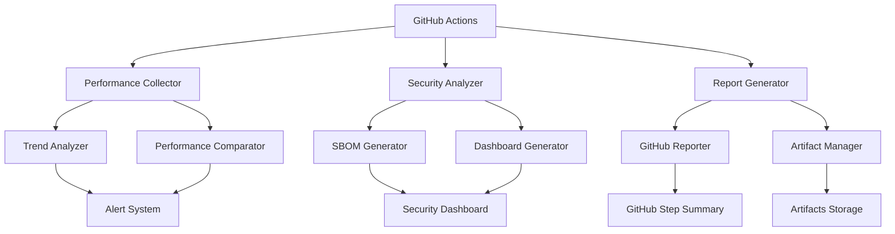

# CI/CD Pipeline Overview

The HB Strategy Sandbox enhanced CI/CD pipeline provides comprehensive monitoring, security scanning, and reporting capabilities for Python projects. This system integrates seamlessly with GitHub Actions to deliver automated quality assurance, performance tracking, and security analysis.

## Key Features

### 🚀 Performance Monitoring
- **Automated Benchmarking**: Continuous performance measurement across builds
- **Regression Detection**: Automatic identification of performance degradations
- **Trend Analysis**: Historical performance tracking and correlation analysis
- **Alert System**: Configurable thresholds for performance deviations

### 🔒 Security Scanning
- **SBOM Generation**: Software Bill of Materials in multiple formats (CycloneDX, SPDX)
- **Vulnerability Analysis**: Automated dependency vulnerability scanning
- **Security Dashboard**: Comprehensive security health reporting
- **Compliance Tracking**: Support for various security frameworks

### 📊 GitHub Integration
- **Step Summaries**: Rich reporting directly in GitHub Actions
- **Artifact Management**: Automated generation and storage of reports
- **PR Integration**: Contextual reporting on pull requests
- **Dashboard Publishing**: Automated documentation updates

### 📈 Advanced Analytics
- **Correlation Analysis**: Performance metric relationships
- **Anomaly Detection**: Statistical identification of unusual patterns
- **Multi-dimensional Comparison**: Cross-platform and cross-version analysis
- **Custom Metrics**: Extensible measurement framework

## Architecture Components

## Core Modules

### Performance Module
- **Collector**: Gathers system metrics, benchmark results, and environment data
- **Comparator**: Analyzes performance changes against baselines
- **Trend Analyzer**: Provides statistical analysis and anomaly detection

### Security Module
- **Analyzer**: Scans dependencies and generates vulnerability reports
- **SBOM Generator**: Creates Software Bill of Materials
- **Dashboard Generator**: Produces comprehensive security overviews

### Reporting Module
- **GitHub Reporter**: Integrates with GitHub Actions for rich reporting
- **Report Generator**: Creates comprehensive dashboards and summaries
- **Artifact Manager**: Handles report storage and distribution

## Integration Points

### GitHub Actions Workflow
The pipeline integrates at multiple points in your CI/CD workflow:

1. **Build Phase**: Performance data collection
2. **Test Phase**: Benchmark execution and metrics gathering
3. **Security Phase**: Dependency scanning and SBOM generation
4. **Report Phase**: Dashboard generation and artifact publishing

### Configuration Management
- **Performance Thresholds**: Configurable via YAML files
- **Alert Rules**: Customizable notification settings
- **Security Policies**: Flexible vulnerability handling
- **Report Templates**: Customizable output formats

## Benefits

### For Development Teams
- **Early Detection**: Identify performance and security issues before production
- **Historical Tracking**: Understand long-term trends and patterns
- **Automated Reporting**: Reduce manual overhead for quality assurance
- **Standardized Metrics**: Consistent measurement across projects

### For Security Teams
- **Comprehensive Visibility**: Complete software composition analysis
- **Vulnerability Tracking**: Automated identification and prioritization
- **Compliance Support**: Framework-specific reporting
- **Risk Assessment**: Quantified security health scoring

### For Operations Teams
- **Performance Baselines**: Established performance expectations
- **Regression Prevention**: Automated quality gates
- **Trend Analysis**: Proactive capacity planning
- **Integration Monitoring**: End-to-end pipeline health

## Getting Started

1. **Setup**: Configure the pipeline in your GitHub Actions workflow
2. **Baseline**: Establish initial performance and security baselines
3. **Monitor**: Review automated reports and dashboards
4. **Optimize**: Use insights to improve performance and security
5. **Scale**: Extend the pipeline to additional projects and metrics

For detailed implementation guidance, see the [User Guide](user-guide/interpreting-reports.md) and [Developer Guide](developer-guide/architecture.md).
